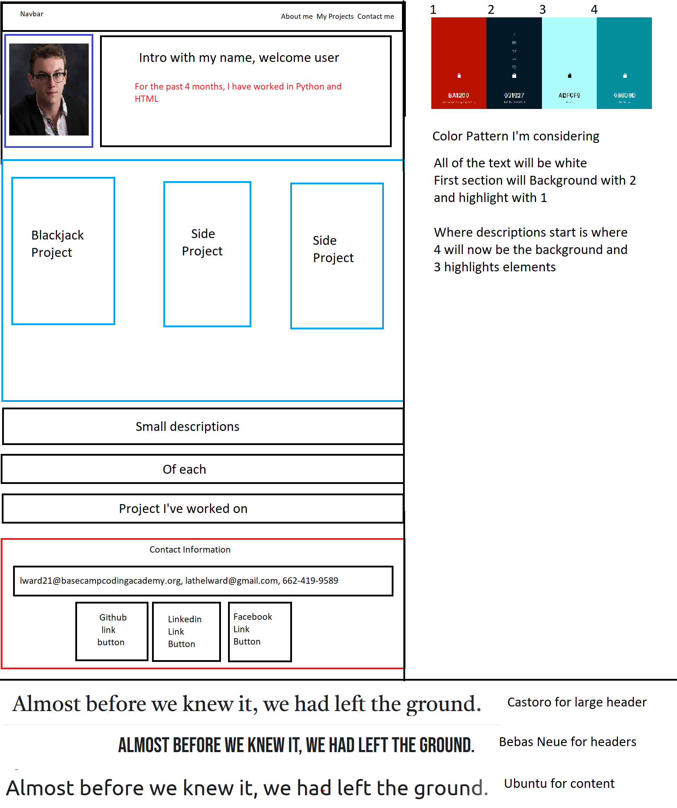

# Unit Project 3

Inside, you'll see my portfolio-style website made with HTML/CSS. This is my 3rd unit project since I've been here at BCCA. Over the course of the week, I will be writing the basic content (Ex. my unit projects, side projects, and other code-like endeavours), then styling that content for presentation, adding more content and links, and then finalizing the "look" by the end of this week (12/14/20 to 12-18-20). 

## Monday:
I will be making the final decisions on how I want to lay out the elements of the page, writing the bio, and setting up the work and some styling for tomorrow

My page will be designed similar to this image:

## Tuesday:
On Tuesday, I will be writing the code for the project links. They will consist of 3 seperated elements with descriptions below them of what they are. Also I will be writing out my contact information at the bottom of the page, consisting of actual buttons or button-like elements that link to my social medias. I will also begin adding necessary elements for responsive design. By Thursday, the page will look just as good on mobile as it does on desktop.

## Wednesday:
Images will be added to their designated div elements. These images (where designated) will be links for the user to see my unit/side projects. I will also accomplish a navbar by the end of this day.

## Thursday
Thursday will be designated for final style decisions and format checks (making sure the page looks good on alternate devices).

